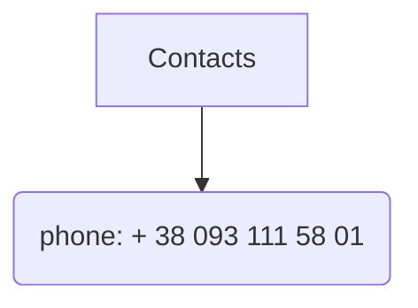

# Sergey Kolesnyk

||A Quick Introduction to Who I Am:||
|-|--|-|


Hello, I'm Sergey Kolesnyk, and I'd like to introduce myself. I'm a graduate of the Odessa National Maritime Academy, where I honed my problem-solving skills and attention to detail. Alongside my maritime education, I have also delved into the world of programming, acquiring a diverse skill set.

My experience extends to several programming languages, including LUA, Python, JavaScript, ActionScript, and Delphi. These languages have allowed me to tackle various challenges and develop solutions in different contexts. I enjoy the creative problem-solving that comes with programming and have successfully applied this skill set in practical projects.

To further enhance my programming knowledge, I've also completed a range of free online programming courses available on platforms like YouTube. These courses have broadened my understanding of various programming concepts and technologies, enabling me to adapt to the ever-evolving tech landscape.

In summary, I'm a graduate of the Odessa National Maritime Academy with a strong background in programming, thanks to my experience with multiple languages and my dedication to continuous learning through online courses. I'm enthusiastic about applying my skills to tackle new challenges and contribute to innovative projects.

||JavaScript code example:||
|-|--|-|

```javascript
function getRandomInspirationalQuote() {
  const quotes = [
    "Believe you can and you're halfway there. -Theodore Roosevelt",
    "Your time is limited, don't waste it living someone else's life. -Steve Jobs",
    "The only way to do great work is to love what you do. -Steve Jobs",
    "Success is not the key to happiness. Happiness is the key to success. If you love what you are doing, you will be successful. -Albert Schweitzer",
    "Don't watch the clock; do what it does. Keep going. -Sam Levenson",
    "The future belongs to those who believe in the beauty of their dreams. -Eleanor Roosevelt"
  ];

  const randomIndex = Math.floor(Math.random() * quotes.length);
  return quotes[randomIndex];
}

// Example usage:
const randomQuote = getRandomInspirationalQuote();
console.log(randomQuote);

```

## My work place: 


I'm proud to be a part of the dynamic world of maritime container logistics. I work as a operation department at Paramira LLC, where we specialize in streamlining the movement of goods across the seas. With a strong background in this field, I'm passionate about ensuring the efficient transportation of containers and cargo, optimizing supply chain processes, and maintaining a keen eye on global trade trends. I'm excited to connect with professionals in the industry and exchange insights to drive innovation and excellence in maritime container logistics.